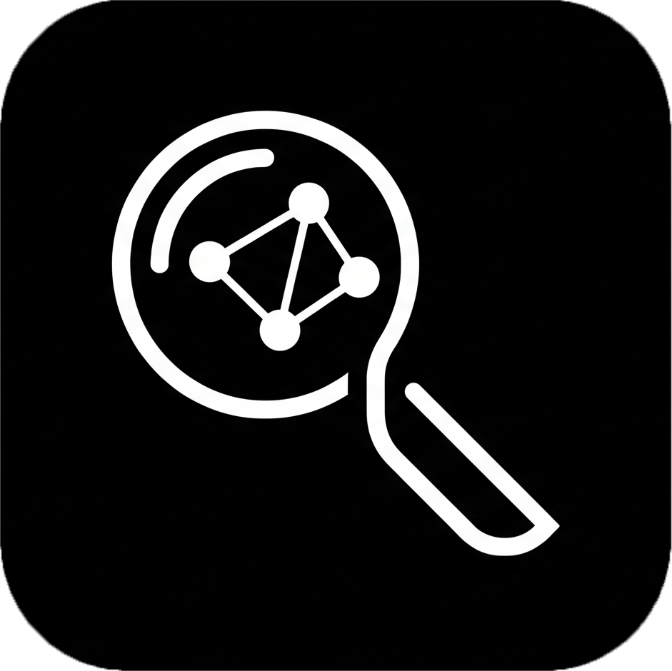
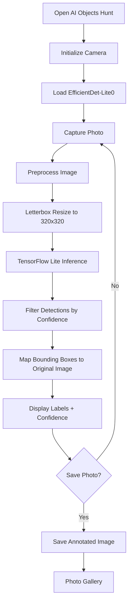
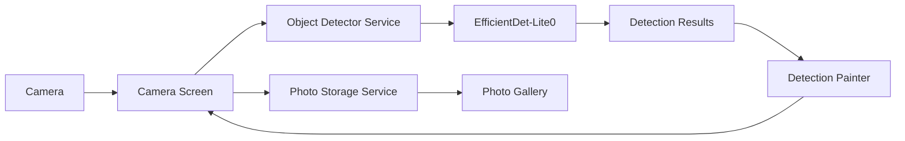

# AI Objects Hunt

<p align="center">
  
</p>

<h1 align="center">AI Objects Hunt</h1>

<p align="center">
  A Flutter mobile application that uses on-device AI to detect objects through the camera.
</p>

<p align="center">
  
  
  
</p>

---

## Overview

**AI Objects Hunt** is a mobile object-detection application built with **Flutter** and **TensorFlow Lite**.

The application uses the device camera to capture images and performs object detection locally with the **EfficientDet-Lite0** model. Detected objects are displayed with bounding boxes, labels, and confidence scores. Users can then save the results and manage captured images in the built-in gallery.

The project is designed as a foundation for an interactive **AI object-hunting game**, where object detection can later be combined with challenges, tasks, and rewards.

## App Icon

The application uses a dedicated launcher icon for **AI Objects Hunt**.

> **Icon path:** `assets/icon/app_icon.png`

<p align="center">
  
</p>

## Features

| Feature | Description |
|---|---|
|**Camera Capture** | Capture images using the device's rear camera |
|**On-device AI Detection** | Detect objects using TensorFlow Lite and EfficientDet-Lite0 |
|**Bounding Boxes** | Display detected objects directly over the captured image |
|**Confidence Scores** | Show the model's confidence for each detection |
|**Save Results** | Save captured images together with detection information |
|**Photo Gallery** | Browse, preview, and delete saved images |
|**Flash Control** | Toggle the camera torch when needed |
|**Model Status** | Display loading and error states while initializing the AI model |
|**Bilingual UI** | Support Vietnamese and English interface text |

## AI Detection Workflow



### Detection Pipeline

1. **Camera initialization** — The app initializes the device camera.
2. **Model loading** — EfficientDet-Lite0 is loaded from the local application assets.
3. **Image capture** — The user takes a photo.
4. **Preprocessing** — The image is converted to the model's required format.
5. **Letterbox resizing** — The image is resized to **320 × 320** while preserving its aspect ratio.
6. **Inference** — TensorFlow Lite performs object detection locally.
7. **Post-processing** — Detections below the confidence threshold are filtered out.
8. **Coordinate mapping** — Bounding boxes are mapped back to the original image coordinates.
9. **Result display** — Labels, confidence scores, and bounding boxes are shown to the user.
10. **Storage** — The user can save the result and access it later from the gallery.

## Project Workflow



## Tech Stack

- **Flutter / Dart** — Cross-platform application development
- **TensorFlow Lite** — On-device machine learning inference
- **EfficientDet-Lite0** — Object detection model
- **Camera** — Camera preview and image capture
- **Image** — Image processing and letterbox resizing
- **Path Provider** — Application storage access
- **Shared Preferences** — Persistent application settings

## Requirements

Before running the project, install:

- Flutter SDK
- Android Studio and Android SDK
- Android device or emulator with camera support
- A device with camera permission enabled

Check your Flutter environment with:

```bash
flutter doctor
```

## Getting Started

### 1. Clone the repository

```bash
git clone <repository-url>
cd ai_objects_hunt
```

### 2. Install dependencies

```bash
flutter pub get
```

### 3. Run the application

Connect an Android device or start an emulator, then run:

```bash
flutter run
```

### 4. Build a Release APK

```bash
flutter build apk --release
```

### 5. Build an Android App Bundle

For Google Play distribution:

```bash
flutter build appbundle --release
```

## Project Structure

```text
ai_objects_hunt/
├── android/                              # Android-specific configuration
├── assets/
│   ├── icon/
│   │   └── app_icon.png                  # Application launcher icon
│   └── models/
│       ├── efficientdet_lite0.tflite     # TensorFlow Lite model
│       └── labels.txt                    # Detection class labels
├── lib/
│   ├── main.dart                         # Application entry point
│   ├── language_state.dart               # Language preference state
│   ├── models/
│   │   └── detection.dart                 # Detection result model
│   ├── screens/
│   │   ├── home_screen.dart              # Home screen
│   │   ├── camera_screen.dart             # Camera and detection screen
│   │   └── photo_gallery_screen.dart      # Saved photo gallery
│   ├── services/
│   │   ├── object_detector_service.dart  # TFLite inference
│   │   └── photo_storage_service.dart    # Photo storage
│   └── widgets/
│       ├── capture_controls.dart          # Camera controls
│       └── detection_painter.dart          # Detection bounding boxes
├── test/                                  # Tests
├── pubspec.yaml                           # Dependencies and asset configuration
└── README.md                              # Project documentation
```

## Model Configuration

### EfficientDet-Lite0

The application currently uses:

```text
Model: EfficientDet-Lite0
Input size: 320 × 320
Color format: RGB
Resize method: Letterbox
```

The model and label files are stored locally:

```text
assets/models/efficientdet_lite0.tflite
assets/models/labels.txt
```

The detection service handles image preprocessing and coordinate conversion so that model detections can be displayed correctly on the original image.

## Detection Threshold

The current confidence threshold is:

```text
0.48
```

It can be adjusted in:

```text
lib/screens/camera_screen.dart
```

A higher threshold generally produces fewer but more confident detections, while a lower threshold may detect more objects at the cost of additional false positives.

## Usage

1. Launch **AI Objects Hunt**.
2. Allow camera permission when requested.
3. Point the camera at an object.
4. Capture an image.
5. Wait for the AI model to process the image.
6. Review detected objects and bounding boxes.
7. Save the result if desired.
8. Open the gallery to view or delete saved images.
9. Use the language control to switch between Vietnamese and English.

## Development

### Add or Replace the Detection Model

1. Place the `.tflite` model in:

```text
assets/models/
```

2. Update:

```text
assets/models/labels.txt
```

3. Update the model configuration in the detection service if the new model uses different input/output specifications.

### Modify Camera Controls

Camera controls are implemented in:

```text
lib/widgets/capture_controls.dart
```

### Modify Detection Logic

The main TensorFlow Lite inference logic is implemented in:

```text
lib/services/object_detector_service.dart
```

### Modify Detection Overlay

Bounding boxes and detection labels are rendered by:

```text
lib/widgets/detection_painter.dart
```

## Roadmap

- [x] Camera capture
- [x] TensorFlow Lite object detection
- [x] Bounding-box visualization
- [x] Photo saving
- [x] Photo gallery
- [x] Flash control
- [x] Vietnamese / English UI
- [ ] Object-hunting challenges
- [ ] Game progression and rewards
- [ ] Expanded object categories
- [ ] Improved detection models
- [ ] Google Play release

## License

This project is open source. See the repository for license details.

---

<p align="center">
  <strong>AI Objects Hunt</strong><br>
  Turn your camera into an AI-powered object hunter.
</p>